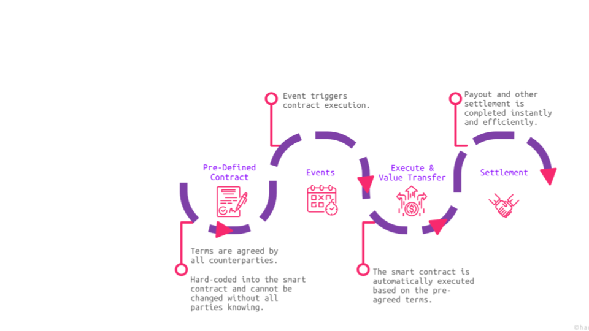
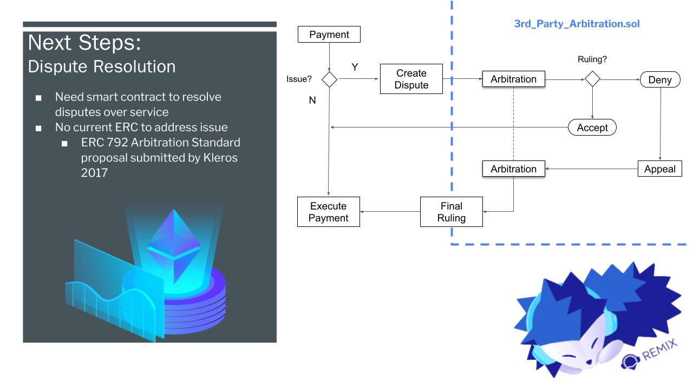
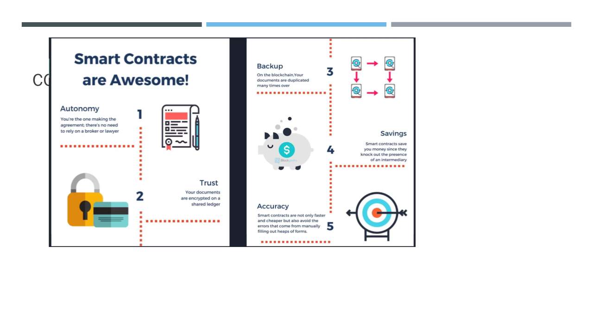

# Unit 23 - Final_Project_Group_3_Node_Warriors "Our Travel Agent Contract!"
Team Members: Antonio Pinkston, Cornelius Hattingh, Jada Williams and Jacinta Oduor: grinning:  

## Background

Customer / corporations / Tour Operators / Sport Teams / Governments (customers/traveler) use the services of travel agents (TA) for travel packages which include: - ancillary fees, hotel, car rentals, tours, activities, shows, special reservations, workshops amongst others The customer or traveler pays the travel agent upfront for the  agreed services.  The payment to the Travel Agent is made on  “Trust” on the mutual agreement that the Travel Agent will transmit the funds for the services paid for (depends on specific SLA’s and timelines).
The International Travel Association- IATA and Airline Reporting Corporation- ARC of which Travel Agents are part of,  clearly require  “… the agent (travel agent) to hold the moneys/funds paid by the customer/traveler in trust, on behalf of the airlines”. They recommend that Travel Agents must have  dedicated bank account (trust account) for such monies/funds held in trust.
There are however no clear rules  for other services  or  some form of oversight over the Travel Agents on how funds deposited with them in these special accounts  are used.
Travel Agents find themselves   entrusted with  large amount of funds and “unlimited credit” (in the form of e-ticket stock).  As a result, Travel Agents are known to use these trust funds for “running expenses” even though they are not allowed to do so. 
There is a big risk attached to this diversion of funds to:-

    1.  The consumer/Traveler.

    2.  Agents 

    3.  Banks  

    4.  Downstream operators and,

    5.  Airlines: 
    
Travel Agents have used funds held in trust because their expectations is that such funds are constant and payments deposited today are used to settle old debts and the cycle goes on until Covid- 19 hit and travel got suspended and there was no inflow of funds. Covid-19 exposed the vulnerability of the Travel Agents' modus operandi.
 Traveler found themselves having to double pay to the airline or hotel because the travel agent failed to release payment in time or a t all. In some instances, agents, airlines & tour operators have gone out of business leaving the traveler stranded or needing to refund their trip.  Policy changes of airlines for cash flow restricting  forced airlines in situations where payment have not been remiited to issue travellers "refund vouchers" for future travel or travel credit. Travellers are known to ldoge complaints to their credit cards financial institutions where services are not rendered as the case in refund vouchers. Card holders are obligated to make refunds in which case it becomes “double dipping blind spots”, i.e where the traveler now holds two refunds, more so because these parties also do not speak to each other. While the situation described has been happening, Covid-19 exposed this vulerability more

    
## Motivation: 

 The team  desires to find a solution by removing the risk of the travel agents holding funds without accountability and the double dipping blind spot. To do so, the team built a Smart Contract which removes the layers of money movement.   
 The team is motivated to be a first in this regard espcially that a member of the team has this experience first hand and would like to explore tools that can improve the travel  agency industry.
## Objective

Create a smart contract with multiple parties. (Traveller / Airline / Hotel/Car rental ) 
Use OpenZeppelin to build a complex smart contract system.
Build a digital marketplace powered by smart contracts.
look at Case Studies on 
Payments / Smart contracts / Blockchain in the travel industry 
The process is summerised in the chart below:-

The team  also checked this link https://drive.google.com/drive/u/0/folders/1sEKyGJXz7VPpf3R1j6m7DPIq5i6zQ1U

## Contract Summary 

The smart contract has the following information:-
 Consumer/Travel Agent and Supplier. In this instance the parties are:- the traveller- who is the called M. John Smith and described as the countract owner. The other parties are the Travel Agent, the Airline, the Hotel and the car rental. 
Confirmation of booking
Segment information (flight, hotel, car rental, etc.)
Supplier information
Service(s) delivery date and price 
Service levels and Payment dates for all segments
The smart contract:
Pays the commission to the agent
Pays the supplier “just in time” 
Can settle any disputes about payment
Creates visibility and real time update

## Arrbitration
The Smart contract has incorporated arbitration clause for dispute redolution as shown below:-

## Files/ Resources https://01classactivities.slack.com/files/U01AGG72258/F01QVJB39J6/paymentsplitter.sol?origin_team=T019ACWBKU6&origin_channel=G01NWK3R8CD
https://01classactivities.slack.com/files/U01AGG72258/F01R87CPT6D/travelagent.sol?origin_team=T019ACWBKU6&origin_channel=G01NWK3R8CD

## Challenges
we encountered the following challenges:-
Funding Accounts. 
Initiating Transactions 
Finding OpenZepplin contracts to suit our concept 
Complexity of the concept

## Conclusion
If we had time we would have done the next steps below. We were however able to successfully create and compile the smart contract and deploy the payment ( at least one of them- the status of the other three is “pending”.  The screen shots are included in the resource file.

